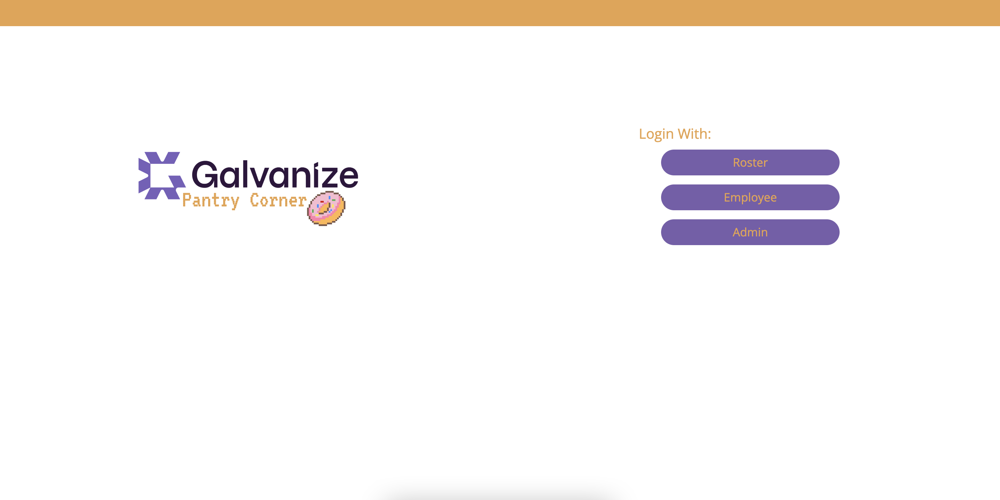

# Team Sense8: Galvanize Pantry Frontend
Deployed link: https://galvanize-pantry.herokuapp.com
# Index Page

 ## Team member:
- Winter Feng
- Jiapei Yu
- Jie Luo
- Wenxi Li
- Mufeng Huang
- Sharon Liu
- Bobo Liu
- Yancong(Peter) Li 

## Project Background
- Project Industry Sponsor: Galvanize
- Contact: Peter Smith
- Sponsor Background: Headquartered in Vancouver BC, Galvanize is a software company with offices in Singapore, London, Tokyo, and Bangalore. The primary business is building security, risk management, compliance, and audit software. Their integrated risk management software approach helps unite these teams with their HighBond platform in order to strengthen individuals and protect organizations.

 ## Business Statement/Requirement:
Employee engagement takes many forms at Galvanize. From scheduling fun events such as regular ping pong tournaments to stocking up on snacks (healthy or otherwise), team participation is high. A simple and often inefficient process is the managing of the office snacks, including candy bars, cookies, chip packets, or fresh fruit. Currently, snacks are stocked up and placed on an empty desk so that staff can help themselves to the items, paying for them via a tip jar. The process is simple and works on the honour system. However, the usage is high and an app to support this would be a welcomed by employees. This could help reduce handling of cash and allow staff to accumulate their items for repayment at a later date.

 ## Project Deliverables:
 ### Employee Module:
Build a web based mobile friendly application that allow users to quickly select from a list items taken. They key is to design a very efficient UI to make the purchasing experience almost as seamless as putting cash into a jar, yet increasing the chances the user will remember to pay for their items. The user can also generate a simple listing/report of what is owing for a period and allow them to enter when a payment has been made (via separate cash or etransfer process).
To simplify the experience, an iPad (or similar) could be left in the snack area, to encourage people to register their purchase while they’re selecting their snack. To avoid having them log in with username and password each time, they could quickly select their name from a list of users. However, to improve accountability, users would be prompted to confirm their purchase when they next log on properly (to avoid people charging other people’s accounts).
Access to the system is integration with Galvanize’s Active Directory (alternate with facebook and google login managed via administration module), although user sessions should last for a full month, to avoid constantly logging in each time they take a snack.
Staff also has abilities to vote for their favourite snacks, or suggest new snack items to include.
 ### Administration Module:
The system should also offer an administrative module to allows admin to add product into a pick list for users (ie: Kettle Chips, KitKat, Good Bar etc). As well, the administrator can update any staff profile that has paid. This continues the honour system model where both administrator or staff can update payment status.
Three reports are expected:
 - A key feature of the administration module is to list current inventory of snacks. Based on pre-determine stock levels, this report can generate a shopping list or PO for suppliers. This allow the administrator semi-automate the purchase/order items as needed.
 - A report to summarize the amount of money owed by each employee, as well as their payment history.
 - Administrator can also generate a favourite snacks voting report to determine if any changes to new items can be considered.
 - A stale inventory report can also be a valuable tool (ie: kitkats are now 3 months old etc). This clearly requires an admin interface for entering new stock detail as it arrives.
 ### Non Functional Requirements:
- Assume maximum user base of 250 and response times for searches/filters be less than 4 seconds.
- System can support up to 10 concurrent users
 ### Stretch Goals (in priority order):
- Multi-browser support (Chrome, Microsoft Edge, Safari, Firefox), including support for those browsers on iPad, iPhone and Android devices.
- Be creative to add functions and usage reports are required and at the discretion of your team to design.
 ### Proposed Technology/Environment:
 - A website package (ie: Wordpress) cannot be used; Public APIs and libraries can be adopted for various functions.
 - Browser standard: Chrome, Safari and Firefox
 - Our preferred technologies – for us to maintain your code afterwards, we’d prefer you select from the following technologies: NodeJS/Express, and/or React.
 
 ## User Guide
 This user document includes the descriptions of different parts of the website. For each page of the website, instructions of how to correctly manipulate it are also included. 

There are three parts of functionalities in this project: Roster, Employee, and Admin. Each part facilitates different operations for different people in the company. For roster, employees can easily purchase snacks without complicated steps to login etc. For employees, the employees can login on their own desktop and operate. Finally for admin, they can manage sorts of things to maintain the system in a good status.

 ### Roster
To access the Roster page, please first click on the “Roster” button. Then all the users that have been logged in will be shown on the page. As an employee of the company, you will honestly choose your own account by selecting your name. Your google account image is also shown to better help you find yourself. By clicking your account, there will be a pop-up confirmation window for you to confirm and process to the next step. After clicking the “Yes” button, you will be brought to another page to choose snacks. By default, clicking the “+” button will add one amount of the snack you choose; and you may adjust the number by clicking the up and down buttons. After choosing all the snacks wanted, then press the shopping cart icon to go to the check-out page. On the check-out page, all the snacks you have chosen will be listed there, with the number of items per snack. The total price is also calculated and shown on the bottom of the page. On this page, the employee may still modify the number of snacks by either deleting it, or increase/decrease the amount. At the end, the employee can check out by clicking the button on the bottom right.

 ### Employee
To access the Employee page, please first click on the “Employee” button. Employees will need a google account to sign in. If this is the first that the employee logs in, the system will automatically create a profile for this user. If it is the first the user logs in, and that he/ she has never purchased any snacks via the Roster page, there will not be any order history for that employee. Once logged in, there are two options for the users: View Order History, and Vote for Snack. Normally, when the employee views their order history, all the history will be shown. Then the employee may filter the history by their status; can be either “pending” or “paid”. Simply press the status to view the corresponding order history. For each order history, the items purchased are shown, with their price. In addition, the purchase date and a total price are also included. The other option is to vote for the favourite snacks or to recommend new snacks to the company. Click to enter the voting page, a list of all the existing snacks will be shown and at the bottom there is a spot to enter the name of the new snacks the employee would like to recommend as well as to select the category of the snack. After the employee has finished voting for all the snacks he/ she likes, then hit the submit button to complete the voting procedure.
 ### Admin
To access the Admin page, please first click on the “Admin” button. The admin will need a google account to sign in, and the system will verify if the user actually has the privilege to access; will be rejected if verification is invalid. Once entered, there are four operations that the admin can do. First is to manage users. There are two options, which are to edit the current users and to delete the users. The admin can help change the name, email, and the picture of a user. By deleting a user, all the corresponding records will be deleted as well (if allowed). Second is to manage order. Once entered the page, all the users will be listed. In order to edit one’s order, just simply click on it, all the relevant order history will be shown as a table, including the status, price, items purchased. For each order history, there is a check box on the left. By checking out the box, the admin can then click on the “mark” button to update the status of the order history from “pending” to “paid”. Third is to manage the snacks. The admin can edit the currently existing snacks, add new snacks, and delete snacks. By editing a snack, the admin can replace the image of the snack, set a new price or category, as well as the name of the snack and the number of votes. By adding new snacks, the admin can simply fill in the required field to make a new snack item. Deletion can be done by clicking the snack and confirming. Fourth is to generate reports. There are four types of reports that can be generated. They are the vote report, snack inventory report, stale inventory report, and the employee payment report.

## Installation and other tools Guide
 ### Programming Environment:

- IDE: WebStorm (2020.3.2 or higher) / Visual Studio Code
- Database: MySQL 8.0.23
- Framework: React (17.0.1 or higher)
- API: JavaScript Library ES8
- Source control: github (one backend and one frontend repo)
- ORM: Sequelize 6.6.2 (help generate database)

 ### Production and Test environments: Heroku
we used Heroku to deploy both our front-end and back-end server. They are deployed 
separately, and connected with endpoints. In addition, there is also a remote database 
used; it is an add-on from Heroku, and it is currently linked with our back-end server.

### Installation Guide for Local Testing/Development:

 1. Front-end:
you may open the front-end file via any text editor or IDE; and please open it as a whole file.
then use Terminal if you are on a Mac or the Command if you are  on a Windows, cd into the front-end folder. 
once you are in the folder, please enter the following command: “yarn install”.
then some installation procedure will start and please just wait until it is finished.
to be noted, if “yarn install” does not work on your machine, please also try “npm install”. However, “yarn install” is preferable.
in addition, if your computer does not have “yarn” pre-installed, please google search about it, and download it before doing all the previous steps.

 2. Back-end:
you may open the back-end file via any text editor or IDE; and please open it as a whole file.
then use Terminal if you are on a Mac or the Command if you are  on a Windows, cd into the back-end folder. 
once you are in the folder, please enter the following command: “yarn install”.
then some installation procedure will start and please just wait until it is finished.
to be noted, if “yarn install” does not work on your machine, please also try “npm install”. However, “yarn install” is preferable.
in addition, if your computer does not have “yarn” pre-installed, please google search about it, and download it before doing all the previous steps.

Installation procedures for both back-end and front-end are very similar, since all the dependencies have pre-written on the json file, and “yarn install” would simply take care of the work. Once finished installing all the required things, there are a few more steps to go and some additional notes depending on how you would like to test.

 ### Test locally with a local database:
- In order to use a local database and manipulate it with ease, please go to https://dev.mysql.com/downloads/ to download the MySQL Workbench, as well as the MySQL Community Server. 
- Make sure the database is running.
- Some steps to set up MySQL:
    1. Please enter MySQL on your machine via Terminal/ Command (if you do not know how, please also google search about it. it may vary depending on which systems you are using)
    2. Then enter “CREATE DATABASE databaseName”. For “databaseName”, please enter a name you want.
    3. Once created, you may see it by using the MySQL Workbench, in the root account. For now, only the database is created, and thus no table is there.
    4. then cd into the back-end folder, and please enter “npm install mysql2” and “npm install sequelize”.
    5. Then please find the config.json file in the config folder, and change all the fields to your own local database information (such as the account name, password)
    6. Then also please go to src/database/connection.js. Change the first four parameters of the sequelize object respectively: databaseName, account (usually just root), password, and “localhost”.
    7. Once all these are set up, please enter “sequelize db:migrate” to auto-generate all the tables on your database.
 - To start the backend server please enter: `npm run dev:server`, and enter `npm start` to start the frontend. 
- If you see an error in the backend like "incompatible with sql_mode=only_full_group_by", this is due to the sql_mode, you will need to remove "only_full_group_by". 
    - option 1: you can run these two sql commands (this change might be lost after mysql restart, for permanent fix, see option 2): 
SET GLOBAL sql_mode = `STRICT_TRANS_TABLES,NO_ZERO_IN_DATE,NO_ZERO_DATE,ERROR_FOR_DIVISION_BY_ZERO,NO_ENGINE_SUBSTITUTION`;
SET SESSION sql_mode = `STRICT_TRANS_TABLES,NO_ZERO_IN_DATE,NO_ZERO_DATE,ERROR_FOR_DIVISION_BY_ZERO,NO_ENGINE_SUBSTITUTION`;
    - option 2: if the above two commands don’t work, please search google to remove “only_full_group_by” from mysql_mode by updating the mysql config file.

### Test locally with the remote database:

To test locally with a remote database, there is not much to set up. Please only go to the front-end folder, and enter “npm start” to start the front-end. For the back-end folder, please also enter “npm run dev:server” to start. Once started, you can go to http://localhost:3000/ to test.

 ### IMPORTANT
If you are testing locally with the remote database, please do not do any uploading images. Since uploading images via this setting would create an image_url that can only work for the local, and this url is also going to be stored in the remote database, then it will eventually break the deployed website. 
if you are testing with a iphone or ipad, please (in settings) disable “Block All Cookies” and “Prevent Cross-Site Tracking”

 ### Side notes
When an employee votes for a snack that is not existing, it is considered as “newly recommended”. The admin would need time to consider the suggestions. A newly recommended snack is created on the system, but it will not yet be shown on the snack page when someone is trying to purchase snacks. In addition, since the employee does not upload an image for the newly recommended snack, it is shown with a placeholder image, until the admin updates it.

